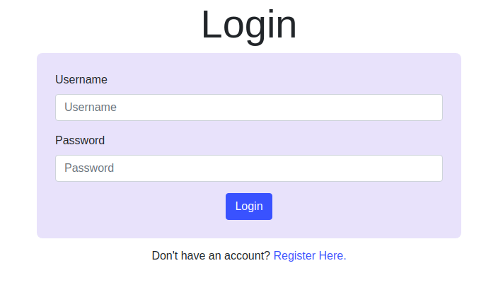
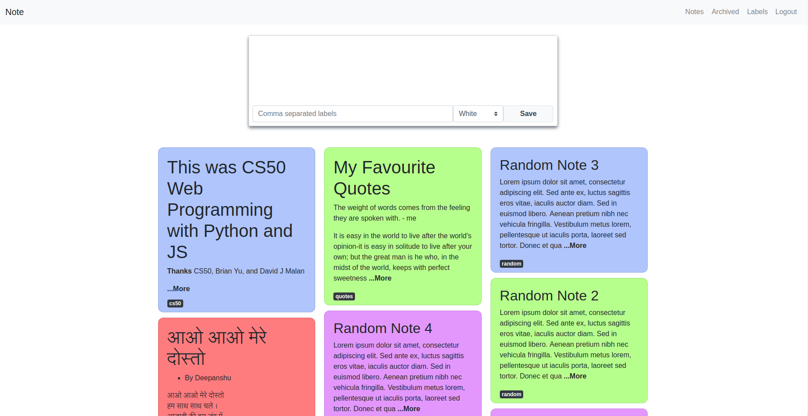
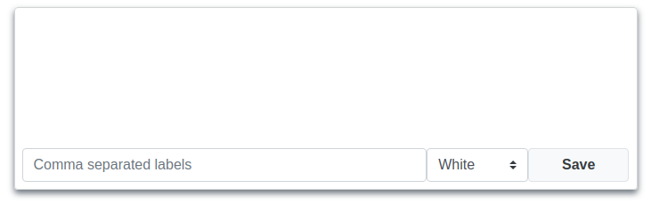
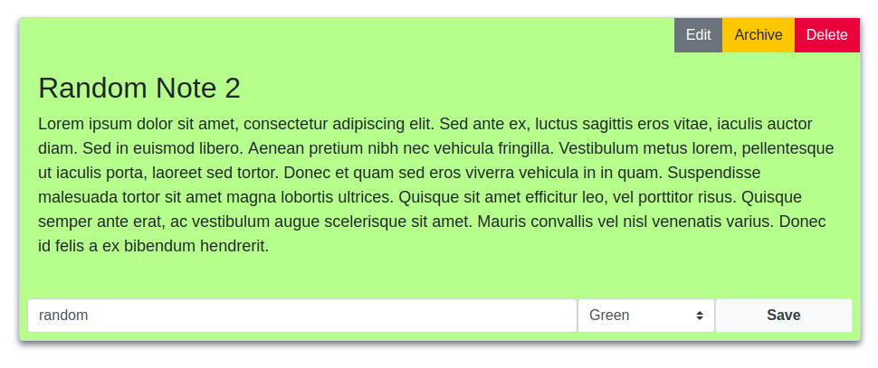
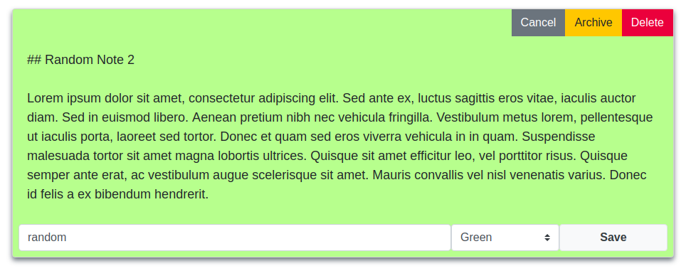
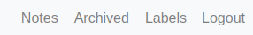
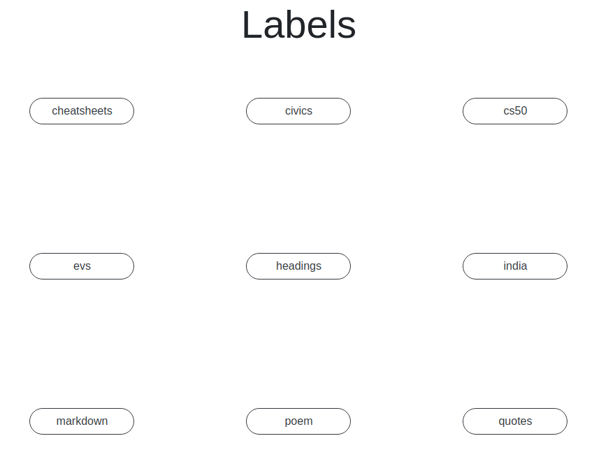

# Note

### A web application for taking notes with markdown


Table of Content:

- [Project Details](#project-details)
- [Tech Stack](#tech-stack)
- [Files](#files)
- [APIs](#apis)

# Project Details

**Note** is a web application for taking notes using markdown.

Features Include:

- *Authentication system*: The user must register and login for using this app.

  

- *Home page:* The homepage of the app contains all the *unarchived* note, only a summary and label are shown on the homepage.

  

- *Note creation with Markdown*: User can create notes through the homepage.

  - The note will <u>support markdown</u> for formatting.
  - The user can optionally include **labels** and a **color** for every note.
  - If the user does not provide any text, the note will note be created.

  

- *Viewing a note*: User can view a note by clicking the note summary.

  - This will present the complete note in proper formatting.

  - User can also edit, archive, and delete the note from here.

  

- *Editing a note*: User can edit a previously written note by clicking the edit button in note view.

  - Clicking the editing button will change the note back to markdown, where user can edit the note, change the labels and color and save it again.

  

- *Archiving a note*: User can archive a note by clicking the archive button in note view.

  - Clicking the archive button will archive the note, and the user will be redirected to the home page where the note no longer exist.
  - Archived notes can be viewed in archived section.

  

- *Deleting a note*: A note can also be deleted when no longer needed.

  - Deleting a note will redirect user to home screen where a message of deletion will be displayed for 3 seconds.

- *Viewing Labels*: The user can view all the labels created using the Labels Page.

  - Clicking on a label will <u>show all the notes</u> with that label.
  - 'No Label' is shown for labels with no label.

  


## Tech Stack:

1. Python with Django for Back-end.
2. JavaScript for front-end.
3. HTML
4. CSS with Bootstrap.
5. Postgres


# Files

- Project Name: **capstone**

- App name: **note**

- **Back-end Files:** In **note** directory

  - urls.py: Contains urls for the pages and api endpoints used in the app.
  - views.py: Contains Django views for rendering templates and performing API operations.
  - models.py: Contains models for the app and serializer functions for models.
    - **User**
    -  **Labels**
    - **Note**
  - forms.py: Contains a Django model form for registering a user.
  - admin.py: Contains configuration for /admin panel.
  - tests.py: Contains test cases for models and views.
  - test-pages.py: Contains test for login and registering web page.

- **Front-end Files**: In template/note and static directories.

  - **Templates**:
    - layout.html: Contains the HTML layout for all pages.
    - index.html: Contains all the 'sections' that are generated with JavaScript.
    - login.html: Contains a form for login and JS for validating the form on client side.
    - register.html: Contains a form for registering and JS for validating the form on client side.
  - **Scripts**:
    - main.js: Contains events for navigation and events for creating, editing, deleting, and archiving a note.
    - newnote.js: Contains event handler for creating a new note.
    - notes.js: Contains functions for loading and displaying notes and note summaries.
    - editnote.js: Contains functions for editing, archiving, and deleting a note.
    - labels.js: Contains functions for loading and displaying all the labels.
    - noteutils.js: Contains functions for changing color of notes.

- **Extra Files**: In root folder - capstone

  - README.md: This file you are reading, contains information about project.
  - requirements.txt: Contains dependencies.
  - README.assets: Folder containing images used in README.md

  

# APIs

- Get summaries for all notes:

  - endpoint: `note`
  - method: `GET`

  ```json
  [
      {
          'noteId': 0,
          'username': 'username',
          'text': 'Note text',	// First 300 Characters
          'color': 'red',
          'labels': [label1_dict, label2_dict],
          'isArchived': true,
          'datetime': , 'Oct 16 2020, 06:26 PM',
      },
      {
          'noteId': 1,
          'username': 'username1',
          'text': 'Note text',	// First 300 Characters
          'color': 'blue',
          'labels': [label1_dict, label2_dict],
          'isArchived': false,
          'datetime': , 'Oct 16 2020, 06:26 PM',
      }
  ]
  ```

- Save a new note in database:

  - endpoint: `note`
  - method: `POST`

  ```json
  {
      'text': 'Note Text',
      'color': 'red',
      'labels': ['label1', 'label2'],
  }
  ```

- Get a full note with an id:

  - endpoint: `note/edit`
  - method: `GET`

  ```json
  {
          'noteId': 0,
          'username': 'username',
          'text': 'Note text',
          'color': 'red',
          'labels': [label1_dict, label2_dict],
          'isArchived': true,
          'datetime': , 'Oct 16 2020, 06:26 PM',
  }
  ```

- Edit a note with an id:

  - endpoint: `note/edit`
  - method: `PUT`

  ```json
  {
      'noteId': 0,
      'text': 'Note Text',
      'color': 'red',
      'labels': ['label1', 'label2'],
  }
  ```

- Delete a note with an id:

  - endpoint: `note/edit`
  - method: `DELETE`

  ```json
  {
      'noteId': 0,
  }
  ```

- Archive/Unarchive a note:

  - endpoint: `note/edit/archive`
  - method: `PUT`

  ```json
  {
      'noteId': 0,
  }
  ```

- Getting all labels:

  - endpoint: `labels`
  - method: `GET`

  ```json
  [
      {
          'labelId': 0,
          'username': 'username',
          'label': 'label1',
      },
      {
          'labelId': 1,
          'username': 'username',
          'label': 'label2',
      }
  ]
  ```


---
